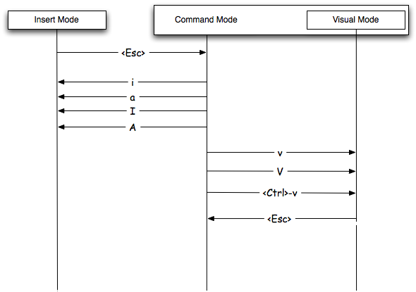

# This week:
## Introductory Computing 1

.pull-left[
### Cannon & logistics
### R/RStudio;
- Download and Install
- Basic commands
- Getting Help
- Data manipulation
    - Introduction to dplyr
    - filter, summarize, groupby, mean
    - Pipe `%>%`
- Plotting
]

.pull-right[
### Bash scripting;
- Getting help
- STDIN/STDOUT, pipe
- Math
- Variable
- Conditional
- Please signup for Cannon!
]

---

# Next week:

## Introductory Computing 2 (Philip)
    
- Python File Parsing
- A Trip to Cannon
    - BWA and STAR
- HW1 Questions

---
class: inverse, center, middle

# Get Started


---

# Cannon Signup

Please fill in the Cannon signup form today:

https://forms.gle/iur3zRUNmegkJE3ZA

Cannon is Harvard's computing cluster. Until recently, it used to be called Odyssey. You might still hear us refer to Odyssey out of habit, but know that they mean the same thing.
You'll need it to complete the first HW.

---

# Join the course Slack

The easiest way to interact with your peers and the TFs.

https://join.slack.com/t/stat115215/shared_invite/zt-l0xve1bl-T0bs8E9RTHPIGMd6qTtnVg

---
# Homework logistics

This is an R Markdown document that I have output to an HTML presentation. Markdown is a simple formatting syntax for producing HTML, PDF, and MS Word documents. For more details on using R Markdown see <http://rmarkdown.rstudio.com>.

Each homework will be completed in this format and you will submit both the markdown document with code (.Rmd) and the compiled document (.html). **You only need to submit html for HW1**. With this format all necessary code (including python/bash code!) may be included in one source and the graders may easily reproduce your results.

Homework files will be provided in several sources depending on thir type/size. Canvas will contain the problem sets and you will submit your completed homework here. GitHub will also contain the problem sets as well as necessary (small) datasets, etc. The Cannon cluster will contain larger datafiles (/n/stat115/) and will be necessary for high performance computing later in the semester.

First, let's get R/RStudio downloaded!
[Download R](https://www.r-project.org/) and [Rstudio](https://rstudio.com/products/rstudio/)


---

# Install Packages from CRAN

We often want to install packages to add some extra functionality on top of base R (https://cran.r-project.org/). To do so, we need to know the name of the package (often found via a google search) and we need to install it. Once installed, we need to load the package into the namespace. 

Let's try to install the `nycflights13` package.

```{r, eval=FALSE,echo=TRUE, message=FALSE}
install.packages("nycflights13")
install.packages("ggplot2")
install.packages("dplyr")
```

Load the packages using the `library` command.

```{r, message=FALSE}
library(nycflights13)
library(ggplot2)
library(dplyr)
```

Now make sure to open the markdown document and follow along! Download either from canvas or from (https://github.com/stat115/Lab1).

---

# Quick GitHub Detour

GitHub is a version control system that we will be using primarily as a repository for the homeworks and labs. It is a great tool and we recommend learning and utilizing GitHub for your own work. Lots of tutorials are available such as (https://guides.github.com/activities/hello-world/). 

You will only be required to download the homework files and labs but there are many more features worth learning (commiting, branching, etc.). But first, let's download the lab files.

*Please do NOT disclose your homework answers on public Github Repos!*

---

# Quick GitHub Detour

- First, register for an account (https://github.com/join)
    - Students get some great extras free for two years as well (https://education.github.com).

- Navigate to the stat115 github page (https://github.com/stat115/)

- Click on the Lab 1 repository

- Click the "Clone or download" button.
    - Either Download Zip and open in finder/explorer. Open in RStudio.
    - Alternatively, copy the URL to the clipboard (https://github.com/stat115/Lab1.git). Switch to RStudio. Click the "Project (None)" button in the near the top menu bar. Click "New Project", "Version Control", "Git", then paste the URL into the first box.
    - Third option, download from Canvas and open/save as a new R markdown file (.Rmd).

- Now this will open up a stylized coding window. Please scroll to $\approx$ line 120

---

# Reproducible reports in R markdown

To submit your homework you will need to knit the homework .Rmd file.

When you click the **Knit** button a document will be generated that includes both content as well as the output of any embedded R code chunks within the document. You can embed an R code chunk like this:

# Big
## Kinda big
### Still biggish

---

You can also **bold**   or *italicize* text easily. LaTex code may be added inline, such as $\sum_{i=1}^{N} x_i$, as well as inline `code`. Images are very easy to display as well (see above). To suppress code, name chunks, etc. we need to specify the option to the R code chunk. Note that `echo=FALSE` may be added and the code chunk will not be shown at all.

```{r section_name, eval=TRUE}
print("hello world!")
```

---

You can also embed plots, for example:

```{r fig.height=4}
library(ggplot2)
library(dplyr)
flights %>%
    ggplot(aes(x = origin, y = arr_delay)) + geom_boxplot() +
    ggtitle("Arrival Delays for Flights in NYC Area")
```


A great cheatsheet is available [here](https://www.rstudio.com/wp-content/uploads/2015/02/rmarkdown-cheatsheet.pdf).


---

# Working directory

```{r, eval=FALSE, echo=TRUE}
# where am I
getwd()

# change where I am (use the RStudio Session > Set Working Directory >
# To Source File Location)
setwd("~/Downloads/")
```

This is usually the issue when R Markdown can't find a file.

---
class: inverse, center, middle

# R basics


---

# Data types and Data structures in R

Now we will go over basic R commands and data structures.

R has 6 basic data types. 

- character `"A"`
- numeric `1`
- integer `1L`
- logical `TRUE, T`
- complex `1+1i`

R has many data structures. These include

- atomic vector
- list
- matrix
- data frame
- factors


---

# R Vectors

R is by nature vectorized, (which is different from Python list).

```{r}
x <- c(1,2,3,4,5) 
print(x[1]) # Index by number

# Operations are performed to each element
x^2
sqrt(x)

# Vectors may be logical as well
print(x[x<3]) # Index by logical vector

# initialize an empty vector
vector("numeric", 5)
```

---

# R Matrices

Matrices is a R vector with dimension attribute. It is also atomic.

```{r}
y <- matrix(1:8,nrow=2,ncol=4,byrow=FALSE) # Create a 2x4 matrix
str(y)

y[1,2] # Access first row second column
y[,2] # Access the second column
dim(y) # Size of y
y %*% t(y) # Matrix multiplication
```

Try `dim(y) <- NULL` and see what will happen.

---

# R list

A list is a generic vector containing other objects.

```{r}
# Create a list containing a vector, a matrix and a list.
list_data <- list(c("Jan","Feb","Mar"), 
                  matrix(c(3,9,5,1,-2,8), nrow = 2),
                  list("green",12.3))

# Give names to the elements in the list.
names(list_data) <- c("1st Quarter", "A_Matrix", "A Inner list")

# Show the list
str(list_data)

```


---

# R Data Frames

Dataframes are list of R vectors of same `length`.

```{r}
data(mtcars) # a famous dataset
str(mtcars) # a list of list of numerical vectors
```

---

```{r}
mtcars[1,1]
head(mtcars[1])
head(mtcars[[1]])
sapply(mtcars, sum)
```

Can you tell the difference between `mtcars[1]` and `mtcars[[1]]`?


--- 

# Getting Help

- `?` command, e.g. `?median` or `?mtcars`
- Google or Stack Overflow
- Github issue or PR.


---

# Data Manipulation with `dplyr`

- `dplyr` is an R package or "grammar" that makes it really easy and intuitive to manipulate data.
- Data science (and computational biology) is 80% data cleaning, 20%
analysis.
- Material taken from dplyr vignette: https://cran.r-project.org/web/packages/dplyr/vignettes/dplyr.html

```{r}
head(flights)
```


---

## filter

- Select specific rows based on conditions.

```{r}
filter(flights, month == 1, day == 1)
```

---

## select

- Select specific columns

```{r}
select(flights, year, month, day)
```

---

## mutate

- Add new columns

```{r}
mutate(flights,
  gain = arr_delay - dep_delay,
  speed = distance / air_time * 60
)
```

---

## arrange

- Sort dataframe by columns.

```{r}
arrange(flights, year, month, day)
```

---

## desc

- Use `desc` to sort by descending order.

```{r}
arrange(flights, desc(dep_delay))
```


---


## summarize

- Take many numbers and condense them into 1 number.

```{r}
summarise(flights,
  delay = mean(dep_delay, na.rm = TRUE)
)
```

---

## group_by

- The true power of `dplyr` is its capacity for `Split-apply-aggregate` workflow.
- First, group by plane. Then, summarize the number of flights, average
distance, and average delay.

```{r}
by_tailnum <- group_by(flights, tailnum)
delay <- summarise(by_tailnum,
  count = n(),
  dist = mean(distance, na.rm = TRUE),
  arr_delay = mean(arr_delay, na.rm = TRUE))
delay <- filter(delay, count > 20, dist < 2000)
delay
```


---

# The pipe

How to process data for multiple steps? Consider:

```{r, message=FALSE}
a1 <- group_by(flights, year, month, day)
a2 <- select(a1, arr_delay, dep_delay)
a3 <- summarise(a2,
  arr = mean(arr_delay, na.rm = TRUE),
  dep = mean(dep_delay, na.rm = TRUE))
a4 <- filter(a3, arr > 30 | dep > 30)
```

Note that we are creating variables (e.g `a1`) which we then immediately use in the next operation, and then never again. This is generally not good practice, and variables are wasted.

---

What about this one:

```{r}
filter(
  summarise(
    select(
      group_by(flights, year, month, day),
      arr_delay, dep_delay
    ),
    arr = mean(arr_delay, na.rm = TRUE),
    dep = mean(dep_delay, na.rm = TRUE)
  ),
  arr > 30 | dep > 30
)
```

Yuk!

---

# The pipe ` %>% `

But this can be hard to read, since we are going inside-out. Instead,
we can use the `%>%` command, which turns `f(x, y)` into `x %>% f(y)`.
This is much easier to read.

```{r}
flights %>%
  group_by(year, month, day) %>%
  select(arr_delay, dep_delay) %>%
  summarise(
    arr = mean(arr_delay, na.rm = TRUE),
    dep = mean(dep_delay, na.rm = TRUE)
  ) %>%
  filter(arr > 30 | dep > 30)
```

Pipe is not invented in `dplyr`, but `magrittr`. It can also be used in other scenarios.

```{r}
letters %>% length()
```

---

### Pipe with `group_by`

- What is this code doing?

```{r}
flights %>% filter(origin == "EWR") %>%
    group_by(dest) %>%
    summarize(n = n()) %>%
    arrange(desc(n))
```

---

```{r}
library(survival)
# Load in dataset
data(colon)
# Show first 6 rows of the dataset
head(colon)
```

The `colon` dataset contains several variables, among which the treatment, sex (1 = male), age, and several trial-specific indicators. `etype` indicates the event of a death or a recurrence.
---
Several functions we've seen for transforming data:

1) select

2) filter

3) mutate

4) arrange

5) summarise

Exercise: let's do the following consecutive operations on our `colon` dataset (make sure to use the %>% operator!).

1) The `study` column only contains ones, so remove it for clarity

2) We only want rows with etype 2 (these are death events rather than recurrence)

3) Round time to months (for simplicity, assume a month has exactly 30 days)

4) Sort our dataframe by age (from low to high age)

5) Show a simple summary of the average survival time, in months, grouped by treatment.

---

### Solution

```{r}
colon %>% 
  select(-study) %>%
  filter(etype == 2) %>%
  mutate(time = round(time/30)) %>%
  arrange(age) %>%
  group_by(rx) %>%
  summarise(avg_months = mean(time))
```

---

# Plotting with `ggplot2`

```{r, fig.height=4}
flights %>%
    filter(arr_delay <= 360) %>%
    ggplot(aes(x = factor(month), y = arr_delay, color = origin)) +
    geom_boxplot() +
    ggtitle("Delay by Month") +
    xlab("Month") +
    ylab("Arrival Delay (min)")
```

---
# Plotting with `ggplot2`
```{r, fig.height=4}
flights %>%
    filter(month == 1, arr_delay < 360, dep_delay < 360) %>%
    ggplot(aes(x = dep_delay, y = arr_delay)) +
    geom_point() +
    ggtitle("Relation between Dep and Arrival Delay") +
    xlab("Departure Delay (min)") +
    ylab("Arrival Delay (min)")
```

A great introduction for `ggplot2` can be found [here](https://ggplot2.tidyverse.org/#learning-ggplot2).


---
class: inverse, center, middle

# Bash basics

---

# What is bash?

> Bash is a command processor that typically runs in a text window where the user types commands that cause actions. Bash can also read and execute commands from a file, called a shell script.

# Why we use it?

- When you do not have a graphical user interface, i.e. no icons, no mouse ..
- When you want to execute commands for 100,000 times (or if you have 100,000 files to open) that may be too much for your mouse click.

---

# Bash commands

## File navigation

```
cd # change directory
ls # list directory content
ls ..
```

In general, a shell command is composed of 
> [command] [options] [arguments]

White spaces are vitally important for parsing each command, which is different from R and python.

```
ls -alh ..
wc -l states.txt
```

---
# Pipe

You can use Pipes (`|`) to stream STDOUT from previous command as STDIN of subsequent command. 

```{r, engine='bash', eval=TRUE}
cat states.txt | wc -l
```

What will happen when you use `yes | head -n 5`?

# Getting help

If you need help for a specific command, use `man [command]`.

---

# Tools for Bash scripting

Bash itself is a little programming language, to fully extend its power you will need to write program - a text file with a header specifying which program to execute the file.

To write a program you will need an editor. 
Vim is one of the options. To get started with Vim, please use `vi [file]`.

## Why use text editor?

Again because you might not have another choice (e.g. MS office, notepad, VS code) on cluster or cloud VMs.


---

# Vim: Basic concepts

You do not need to be an expert in it! Most of the time you will write a program locally and use file transfer tool, e.g. File to Cannon.

```{r, fig.height=5, echo=FALSE, fig.width=4}

```

---


When you `vi filename` you will be on command mode. 

- `i` switch to insert mode
- `Esc` back to command mode
- Navigation: `h j k l`, by word `W w`
- `:wq` save and exit
- `:q!` do not save and exit

---

Some references:

- [Tutorial](https://danielmiessler.com/study/vim/)
- [Games](https://vim-adventures.com/) Interactive games to learn VIM
- [Cheatsheet](https://rumorscity.com/2014/08/16/5-best-vim-cheat-sheet/) You can have one near your desk

```{r, fig.height=2, fig.width=2, echo=FALSE}

```


---

# Hello World!

Let's create a shell script called `hello.sh`

```{r, engine='bash', eval=FALSE}
vi hello.sh
```

This sequence of characters (`#!`) is called shebang (`#!interpreter [arguments]`) and is used to tell the operating system which interpreter to use to parse the rest of the file.

```
#!/usr/bin/bash
echo Hello world!
```

---

# Math

The Bash programming language can do very basic arithmetic, which we'll
demonstrate in this section.
Now that you have `math.sh` open in your preferred text editor type the following
into your text editor:

```
#!/usr/bin/bash
expr 5 + 2
expr 5 \* 2
expr 5 / 2
expr 40 % 21
```

Save `math.sh` and then run this script in your shell:

```{r, engine='bash', eval=FALSE}
bash math.sh
```

```
## 7
## 10
## 2
## 19
```

---

# Variables

In Bash you can store data in variables. 
You can assign data to a variable using the equals sign (`=`). The data you store in a variable can either be a string or a number. Let's create a variable now on the command line:

```{r, engine='bash', eval=TRUE}
lab_number=1
echo $lab_number
the_empire_state="New York"
echo $the_empire_state
```

Note that white-spaces are not allowed here.

You can modify the value of a variable using arithmetic operators by using the `let` command:

```{r, engine='bash', eval=FALSE}
lab_number=1
let lab_number=$lab_number+1
echo $lab_number
```

---
# Variables

Occasionally you might want to run a command like you would on the command line and store the result of that command in a variable. We can do this by wrapping the command in a dollar sign and parentheses (`$( )`) around a command.

```{r, engine='bash', eval=TRUE}
state_n=$(cat states.txt | wc -l)
echo $state_n
echo "There are $state_n lines in states.txt"
```


---
# User input for bash scripts

## Positional input

```{r, engine='bash', eval=TRUE}
cat var.sh
```

Now let's try running the script:

```{r, engine='bash', eval=TRUE}
bash var.sh a bbb c
```

---

## Interactive input

You could also ask users to type in a string on the command line by temporarily stopping the execution of your program using the `read` command. Let's write a small script where you can see how the read command works:

```{r, engine='bash', eval=TRUE}
cat letsread.sh
```

```{r, engine='bash', eval=FALSE}
bash letsread.sh
```

Now that you know how to pass arguments to your scripts you can start writing your own command line tools!


---
# Conditional Execution

When writing computer programs it is often useful for your program to be able to make decisions based on some inputs. 

The **exit status** informs you if something works as expected. If I enter the name of a command that does not exist into the terminal, then I'll see an error (not zero):

```{r, engine='bash', error=TRUE}
this_command_does_not_exist
echo $?
```

The exit status of the last program run is stored in the question mark
variable (`$?`). What's the exit status of a program that
runs successfully? Let's take a look:

```{r, engine='bash', eval=TRUE}
echo I will succeed.
echo $?
```


---

`true` and `false` are also bash commands that gives specific exit codes

```{r, engine='bash', eval=TRUE}
true
echo $?
false
echo $?
```

---
# AND / OR operators

Conditional execution occurs when the execution of one program depends on the exit status of another program. 

For example in the case of the AND operator, the program on the right hand side of `&&` will only be executed if the program on the left hand side of `&&` has an exit status of 0. 

```{r, engine='bash', eval=TRUE, error=TRUE}
true && echo "Program 1 was executed."
false && echo "Program 2 was executed."
```


The OR operator (`||`) follows a similar set of principles. Commands on the right hand side of `||` are only executed if the command on the left hand side *fails* and therefore has an exit status other than 0. Let's take a look at how this works:

```{r, engine='bash', eval=TRUE}
true || echo "Program 1 was executed."
false || echo "Program 2 was executed."
```

By combining AND and OR operators you can precisely control the conditions for when certain commands should be executed.

There's also the NOT operator `!`, which inverts the value of any conditional expression. 


---


# Conditional Expressions

You can also construct **conditional expressions** which are logical statements that are either equivalent to `true` or `false`. Conditional expressions are always between double brackets (`[[ ]]`). 

For example, if we wanted to see if one integer was greater than another we could use `-gt`, the **g**reater **t**han flag. 

```{r, engine='bash', eval=TRUE, error=TRUE}
[[ 4 -gt 3 ]]
echo $?
[[ 3 -gt 4 ]]
echo $?
```

These **binary** logical expressions compare two values, but there are also **unary** logical expressions that only look at one value. For example, you can test whether or not a file exists using the `-e` logical flag. Let's take a look at this flag in action:

```{r, engine='bash', eval=FALSE}
[[ -e var.sh ]] && echo t || echo f
```

For more choices for logical flags and expressions, check [here](https://opensource.com/article/19/10/programming-bash-logical-operators-shell-expansions)

---

# If-else Statements

- IF statements evaluate conditional expressions. If an expression is true then the code within an IF statement is executed, otherwise it is skipped.

- ELIF and ELSE statements also help control the flow of a Bash program, and IF statements can be nested within other IF statements.


---

An example to find the largest number of all three user inputs. Please be careful about the identation.

```{r engine="bash", eval=TRUE}
cat guess.sh
```

---

# References

Material for bash scripting is adapted from:
[Bash scripting guide](https://github.com/seankross/the-unix-workbench)


---

# Please signup for Cannon!

Thanks for all your questions.


