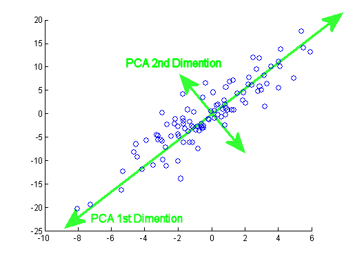
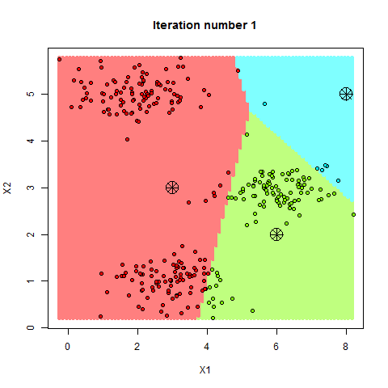
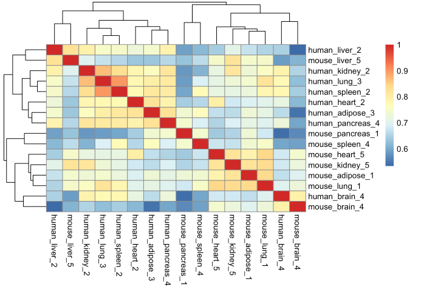
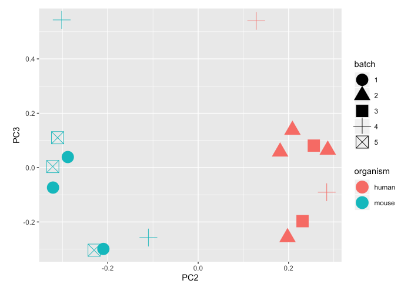
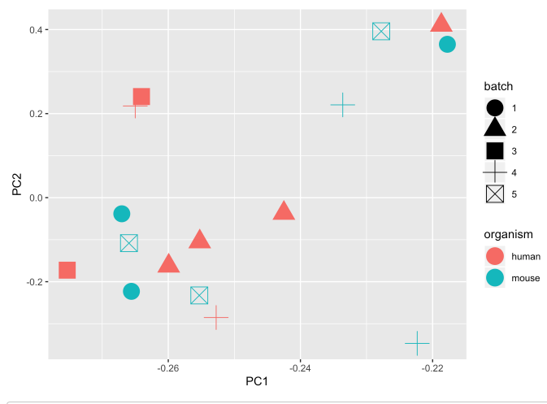
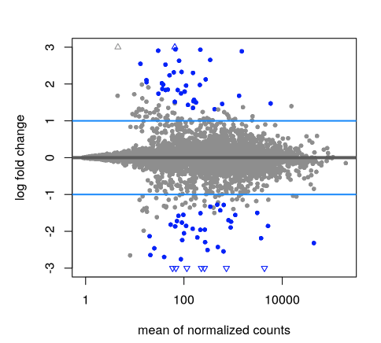
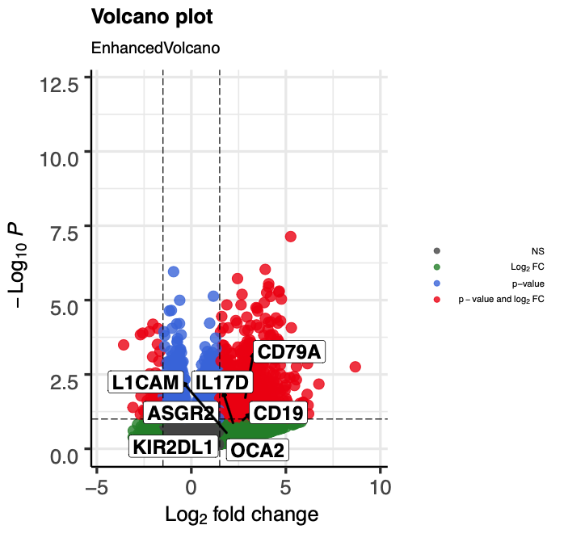
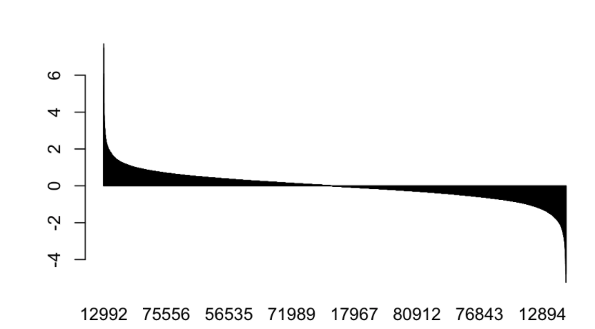
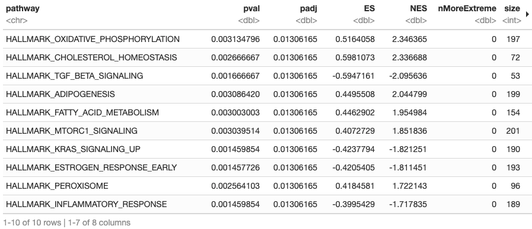
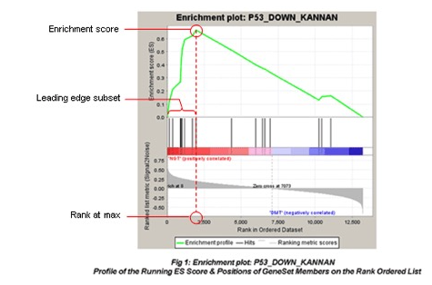

```{r setup, include=FALSE}
knitr::opts_chunk$set(echo = TRUE)
```

## Announcements

- HW2 is out, due 02/21/2021 
- By now, everyone should have a Cannon account

## Outline
- PCA and Hierarchical Clustering
- Batch Removal 
- DESeq2
- KMeans 
- DAVID 
- GSEA
- Next Week: Machine Learning and Modeling accuracy comparison 
## Install and Load Packages

```{r bioc, eval = FALSE,echo=FALSE}
# install packages from bioconductor
if (!requireNamespace("BiocManager", quietly = TRUE))
    install.packages("BiocManager")
BiocManager::install("bladderbatch")
BiocManager::install("leukemiasEset")
install.packages("factoextra")
```

```{r libraries, warning = FALSE, message = FALSE}
library(sva)
library(limma)
library(bladderbatch)
library(leukemiasEset)
library(dplyr)
library(biobroom)
library(ggplot2)
library(factoextra)
library(purrr)
setwd(".")
```

## PCA

- Finds the best linear combinations of the variables.
- "Best" means the variable that describes the largest variance
- Can produce lower-dimensional summaries of the data.
    - Take 100 numbers per sample and summarize them with 2 numbers
    per sample.
- Useful for visualization, among other things.



## PCA Analysis Example
We’ll use the data sets decathlon2 [in factoextra]

Briefly, it contains:

Active individuals (rows 1 to 23) and active variables (columns 1 to 10), which are used to perform the principal component analysis
Supplementary individuals (rows 24 to 27) and supplementary variables (columns 11 to 13), which coordinates will be predicted using the PCA information and parameters obtained with active individuals/variables.
```{r pca}
data(decathlon2)
decathlon2.active <- decathlon2[1:23, 1:10]
head(decathlon2.active[, 1:6])
res.pca <- prcomp(decathlon2.active, scale = TRUE)
pca.var.per = round(res.pca$sdev^2/sum(res.pca$sdev^2)*100,1)
fviz_eig(res.pca, addlabels=TRUE, ylim=c(0,100), geom = c("bar", "line"), barfill = "gold", barcolor="grey",linecolor = "red", ncp=10)+
labs(title = "PCA Coverage",
         x = "Principal Components", y = "% of variances")
ggplot_data <- data.frame(Sample = rownames(res.pca$x),X = res.pca$x[,1], Y = res.pca$x[,2]) 
run<-c()
run[decathlon2.active$X100m<11]<-"slow"
run[decathlon2.active$X100m>=11]<-"fast"
names(run)<-rownames(decathlon2.active)
ggplot(data = ggplot_data,aes(x=X,y=Y,label =Sample, color=run))+
  geom_point()+
  xlab(paste("PC1-",pca.var.per[1],"%",sep =" "))+
  ylab(paste("PC2-",pca.var.per[2],"%",sep =" "))+
  theme_bw()+
  ggtitle("PCA graph of the first two components")
```

## R Aside: Lists

- `pca_result` is a list. It holds a mix of data types.
- Can access an individual list element with `$`, e.g. `pca_result$x`.
- A lot of R functions use lists to return multiple things.
- Look at `prcomp` documentation (`?prcomp`) under Value to see the
meaning of each of the things in the list.

## PCA Variance Explained

- Linear algebra result: $\text{trace}(\Sigma) = \sum_i \lambda_i$
- $\text{trace}(\Sigma)$ can be thought of as total variance.
- Variance of $PC_i$ is $\lambda_i$
- So variance explained by PCs 1 to j is $\frac{\sum_{i = 1}^j \lambda_i}{\sum_{i = 1}^K \lambda_i}$
- Denominator is sum of all eigenvalues 

## KMeans

- An unsupervised method to cluster the data (no labels/outcomes
provided).
- Requires that you specify the number of clusters in advance.
- We can use either all the genes, or only the differently expressed
genes.

### Data Preparation 
- Rows are observations (individuals) and columns are variables
- Any missing value in the data must be removed or estimated.
- The data must be standardized (i.e., scaled) to make variables comparable. Recall that, standardization consists of transforming the variables such that they have mean zero and standard deviation one


```{r k-means}
df <- USArrests
df <- na.omit(df)
df <- scale(df)
distance <- get_dist(df)
fviz_dist(distance, gradient = list(low = "#00AFBB", mid = "white", high = "#FC4E07"))
k2 <- kmeans(df, centers = 2, nstart = 25)
fviz_cluster(k2, data = df)
```
```{r k-means2}
k3 <- kmeans(df, centers = 3, nstart = 25)
k4 <- kmeans(df, centers = 4, nstart = 25)
k5 <- kmeans(df, centers = 5, nstart = 25)

# plots to compare
p1 <- fviz_cluster(k2, geom = "point", data = df) + ggtitle("k = 2")
p2 <- fviz_cluster(k3, geom = "point",  data = df) + ggtitle("k = 3")
p3 <- fviz_cluster(k4, geom = "point",  data = df) + ggtitle("k = 4")
p4 <- fviz_cluster(k5, geom = "point",  data = df) + ggtitle("k = 5")

library(gridExtra)
grid.arrange(p1, p2, p3, p4, nrow = 2)
set.seed(123)

# function to compute total within-cluster sum of square 
wss <- function(k) {
  kmeans(df, k, nstart = 10 )$tot.withinss
}

# Compute and plot wss for k = 1 to k = 15
k.values <- 1:15

# extract wss for 2-15 clusters
wss_values <- map_dbl(k.values, wss)

plot(k.values, wss_values,
       type="b", pch = 19, frame = FALSE, 
       xlab="Number of clusters K",
       ylab="Total within-clusters sum of squares")
```
## Hierarchical Clustering
- Hierarchical clustering is an alternative approach to k-means clustering for identifying groups in the dataset
- Dose not pre-specify the number of clusters
- Generate tree-based representation of the observations, called a dendrogram. 
```{r heriarchecal clustering}
d <- dist(df, method = "euclidean")

# Hierarchical clustering using Complete Linkage
hc1 <- hclust(d, method = "complete" )

# Plot the obtained dendrogram
plot(hc1, cex = 0.6, hang = -1)
```
    

## Batch Effect

- Why is batch effect a problem?
- Example data: Gene expression data from investigation into bladder
cancer.
- Outcome: finding differentially expressed genes that are
associated with cancer status (0/1 in the variable `hasCancer`).
- Already normalized with RMA.
- `pheno`: Dataset that contains phenotypes.
- `edata`: Expression matrix.

```{r,eval= FALSE}
counts <- readRDS("./part3_counts.rds")

# Perform a log TPM normalization
log2tpm <- sapply(1:dim(counts)[2], function(idx){
  log2((counts[,idx]/sum(counts[,idx]) * 1000000) + 1)
})
colnames(log2tpm) <- colnames(counts)
rowVars <- function(x, ...) {
  rowSums((x - rowMeans(x, ...))^2, ...)/(dim(x)[2] - 1)
}
rv <- rowVars(log2tpm)
cutoff <- sort(rv, decreasing = TRUE)[5000]
log2tpm_variable <- log2tpm[rv >= cutoff, ]
colnames(log2tpm) <- colnames(counts)
sample_data <- data.frame(str_split_fixed(colnames(log2tpm), "_", 3))
colnames(sample_data) <- c("organism", "tissue", "batch")
pheatmap(cor(log2tpm))
```

```{r, eval =FALSE}
sample_data_pca <- data.frame(sample_data,prcomp(log2tpm_variable, scale = TRUE, center = TRUE)$rotation)
ggplot(sample_data_pca, aes(x = PC2, y = PC3, shape = batch, color = organism)) +
  geom_point(size= 7)
```

## ComBat

- Perform batch effect adjustment
- Need to specify model matrix: same matrix you use for LIMMA
- Tells ComBat to remove the batch effect but not to remove the
association due to whatever model you are going to run.
- In this example, we model gene expression as a function of whether
or not the sample is cancerous (`hasCancer` variable)

```{r combat,eval= FALSE}
combat_dat <- ComBat(log2tpm_variable, sample_data_pca$batch, par.prior = TRUE)
sample_data_pca_combat <- data.frame(
  sample_data,
  prcomp(combat_dat, scale = TRUE, center = TRUE)$rotation
)

ggplot(sample_data_pca_combat, aes(x = PC1, y = PC2, shape = batch, color = organism)) +
  geom_point(size= 7) 
```


## DESeq 
### Input data
- The values in the matrix should be un-normalized counts or estimated counts of sequencing reads (for single-end RNA-seq) or fragments (for paired-end RNA-seq). It is important to provide count matrices as input for DESeq2’s statistical model to hold, as only the count values allow assessing the measurement precision correctly. The DESeq2 model internally corrects for library size, so transformed or normalized values such as counts scaled by library size should not be used as input.
- A DESeqDataSet object must have an associated design formula. The design formula expresses the variables which will be used in modeling. The formula should be a tilde (~) followed by the variables with plus signs between them (it will be coerced into an formula if it is not already). The design can be changed later, however then all differential analysis steps should be repeated, as the design formula is used to estimate the dispersions and to estimate the log2 fold changes of the model.


http://bioconductor.org/packages/release/bioc/vignettes/DESeq2/inst/doc/DESeq2.html
```{r DESeq,warning = FALSE, message = FALSE}
library("tximport")
library("readr")
library("tximportData")
dir <- system.file("extdata", package="tximportData")
samples <- read.table(file.path(dir,"samples.txt"), header=TRUE)
samples$condition <- factor(rep(c("A","B"),each=3))
rownames(samples) <- samples$run
samples[,c("pop","center","run","condition")]
files <- file.path(dir,"salmon", samples$run, "quant.sf.gz")
names(files) <- samples$run
tx2gene <- read_csv(file.path(dir, "tx2gene.gencode.v27.csv"))
txi <- tximport(files, type="salmon", tx2gene=tx2gene)
```
```{r DESeq 2, warning = FALSE, message = FALSE }
library("DESeq2")
library("apeglm")
ddsTxi <- DESeqDataSetFromTximport(txi,
                                   colData = samples,
                                   design = ~ condition)
dds <- DESeq(ddsTxi)
res <- results(dds)
resultsNames(dds)
resLFC <- lfcShrink(dds, coef="condition_B_vs_A", type="apeglm")
resLFC
```


```{r DESeq 3, eval =FALSE}
resApeT <- lfcShrink(dds, coef=2, type="apeglm", lfcThreshold=1)
plotMA(resApeT, ylim=c(-3,3), cex=.8)
abline(h=c(-1,1), col="dodgerblue", lwd=2)
```

```{r Volcano Plot,eval =FALSE}
EnhancedVolcano(rdf,
    lab = rownames(rdf),
    x = 'log2FoldChange',
    y = 'pvalue',
    selectLab = rownames(subset(rdf, rownames(rdf) %in% c(gd.marker.pos,gd.marker.neg) & log2FoldChange>1.5)),
    xlab = bquote(~Log[2]~ 'fold change'),
    pCutoff = 10e-2,
    FCcutoff = 1.5,
    pointSize = 4.0,
    labSize = 6.0,
    labCol = 'black',
    labFace = 'bold',
    boxedLabels = TRUE,
    colAlpha = 4/5,
    legendPosition = 'right',
    legendLabSize = 8,
    legendIconSize = 2.0,
    drawConnectors = TRUE,
    widthConnectors = 1.0,
    colConnectors = 'black')
```

## DAVID vs. GSEA

- Idea: look for sets of genes (e.g. biological pathways) that are
overrepresented in your results.
- DAVID takes a selected list of differentially expressed genes and sees
if there are genes in certain gene sets that are over-represented by
counting.
- GSEA takes all the genes and uses the test statistics (e.g. t-value).
- Need to have a good definition for the gene set.
- DAVID has its own gene set definitions.
- GSEA requires you to supply your own---can choose many different ones.
    - One good option is [MSigDB](http://software.broadinstitute.org/gsea/msigdb/index.jsp).
    - Curated gene sets from the Broad Institute for many organisms.
    - We will use the Hallmark gene set for humans.

## DAVID

- Take differentially expressed genes from limma.
- Upload tab:
    1. Paste list into DAVID.
    2. Select identifier: AFFYMETRIX_3PRIME_IVT_ID
    3. List type: check gene list.
    4. Submit
- Background tab: select the Affymetrix array that was used.
    - For HW, it's
    Human Genome U133 Plus 2 Array.
- Functional annotation clustering.

```{r david, eval =FALSE}
design <- model.matrix(~pheno$hasCancer)
limma_fit <- lmFit(combat_edata, design) %>%
    eBayes() %>%
    tidy() %>%
    mutate(fdr = p.adjust(p.value, method = "fdr")) %>%
    arrange(p.value)
up_genes <- limma_fit %>% filter(fdr < 0.05, estimate > log2(2))
down_genes <- limma_fit %>% filter(fdr < 0.05, estimate < -log2(2))
write.csv(up_genes, file = "david_up.csv")
write.csv(down_genes, file = "david_down.csv")
```

## GSEA 
The list of differentially expressed genes is sometimes so long that its interpretation becomes cumbersome and time consuming. A common downstream procedure is gene set testing. It aims to understand which pathways or gene networks the deferentially expressed genes are implicated in.

### GSEA analysis
- ranking all genes in the data set
- identifying the rank positions of all members of the gene set in the ranked data set
- calculating an enrichment score (ES) that represents the difference between the observed rankings and that which would be expected assuming a random rank distribution.
#### Create Rank List
```{r ,eval= FALSE}
gseaDat <- filter(shrinkLvV, !is.na(Entrez))
ranks <- gseaDat$logFC
names(ranks) <- gseaDat$Entrez
head(ranks)
barplot(sort(ranks, decreasing = T))
```

```{r, eval= FALSE}
fgseaRes <- fgsea(pathwaysH, ranks, minSize=15, maxSize = 500, nperm=1000)
head(fgseaRes[order(padj, -abs(NES)), ], n=10)
plotEnrichment(pathwaysH[["HALLMARK_ESTROGEN_RESPONSE_EARLY"]], ranks)
```


 ●   The top portion of the plot shows the running ES for the gene set as the analysis walks down the ranked list. The score at the peak of the plot (the score furthest from 0.0) is the ES for the gene set. Gene sets with a distinct peak at the beginning (such as the one shown here) or end of the ranked list are generally the most interesting.

●     The middle portion of the plot shows where the members of the gene set appear in the ranked list of genes.

The leading edge subset of a gene set is the subset of members that contribute most to the ES. For a positive ES (such as the one shown here), the leading edge subset is the set of members that appear in the ranked list prior to the peak score. For a negative ES, it is the set of members that appear subsequent to the peak score.

●     The bottom portion of the plot shows the value of the ranking metric as you move down the list of ranked genes. The ranking metric measures a gene’s correlation with a phenotype. The value of the ranking metric goes from positive to negative as you move down the ranked list. A positive value indicates correlation with the first phenotype and a negative value indicates correlation with the second phenotype. For continuous phenotypes (time series or gene of interest), a positive value indicates correlation with the phenotype profile and a negative value indicates no correlation or inverse correlation with the profile.
