```{r setup, include=FALSE}
knitr::opts_chunk$set(echo = TRUE)
```
##Announcement: 
- HW2 is due this Sunday(02/21/2021) by midnight
- After HW2 submission, please finish the post-homework survey
- Our Lab hour: Tue 6:00-7:30 Thur: 8:00 -9:30 
- Our office hour: Fri 4:00-5:00, Sat: 10:30 -11:30 


## Outline
variance: consistant predicted accuracy 
bias: how well the 
- KNN 
- Ridge regression
- LASSO
- ElasticNet
- Cross Validation
- logistic regression
- SVM
- Random forest


## Install and Load Packages

```{r install, eval = FALSE}
install.packages("class")
install.packages("e1071")
install.packages("caret")
install.packages("msigdbr")
install.packages("pROC")
```

```{r libraries, warning = FALSE, message = FALSE}
library(ggplot2)
library(class)
library(e1071)
library(caret)
library(leukemiasEset)
library(sva)
library(dplyr)
library(biobroom)
library(msigdbr)
library(fgsea)
library(hgu133plus2.db)
library(ggplot2)
library(ggfortify)
library(pROC)
library(caret)
```
## Introduction to Machine Learning
Pattern Identification: 
    - Classification: 
        - supervised
        - Identify Pre-defined class 
        - KNN and SVM 
    - Clustering: 
        - unsupervised
        - Identify Similarity 
        - K-means, Umap 
        
## K Nearest Neighbors (KNN)

- Get the $K$ closest neighbors for each member of the test set by
comparing $X$ for training data to $X$ for test data.
- Based on a vote using these neighbors, assign $y$ to test set.
    - E.g. all the neighbors for one member of test set are normal, so
    classify that member of the test set as normal.


## KNN Example 

```{r leukemia-prep}
data(leukemiasEset)
table(leukemiasEset$LeukemiaType)
# subset to ALL, AML, and NoL
ind <- leukemiasEset$LeukemiaType %in% c("ALL", "AML", "NoL")
ourData <- leukemiasEset[, leukemiasEset$LeukemiaType %in% c("ALL", "AML", "NoL")]
LeukemiaType <- factor(ourData$LeukemiaType)
leukemia_expr <- exprs(ourData)
pca.input <- leukemia_expr %>% t() %>% as.data.frame()
pca.res <- prcomp(pca.input,center=TRUE, scale=TRUE)
input.reduction <- data.frame(pca.res$x[,1:20])
input.reduction$phenotype <- LeukemiaType
rownames(input.reduction) <- rownames(pca.res$x)
# split data into train and test
set.seed(1234)
train_ind <- sample(1:ncol(leukemia_expr), size = 20, replace = FALSE)
expr_train <- input.reduction[train_ind,]
expr_test <- input.reduction[ -train_ind,]
type_train <- input.reduction$phenotype[train_ind]
type_test <- input.reduction$phenotype[-train_ind]

```

## Running KNN

- `knn(train, test, train_cl, k)`.
- Make sure train and test data frames have 1 sample per row.
- Visualize result with confusion matrix function (from caret package).

```{r knn}
control <- trainControl(method="cv", number=5, savePredictions = TRUE,classProbs =  TRUE)
metric <- "Accuracy"
set.seed(115)
knn <- train(phenotype~., data=expr_train, method="knn", metric=metric, trControl=control, tuneGrid=expand.grid(k=seq(1,10,1)))
knnPredict <- predict(knn,newdata = expr_test )
confusionMatrix(knnPredict, type_test )
mean(knnPredict == type_test)
```

## Linear Regression & Logistic Regression 
### Linear Gregression
The aim of linear regression is to model a continuous variable Y as a mathematical function of one or more X variable(s), so that we can use this regression model to predict the Y when only the X is known. This mathematical equation can be generalized as follows:

$Y = β1 + β2X + ϵ$

where, β1 is the intercept and β2 is the slope. Collectively, they are called regression coefficients. ϵ is the error term, the part of Y the regression model is unable to explain.
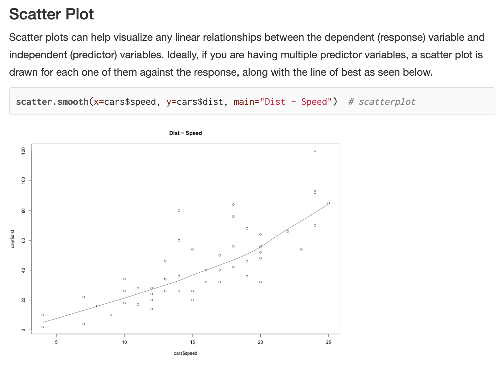

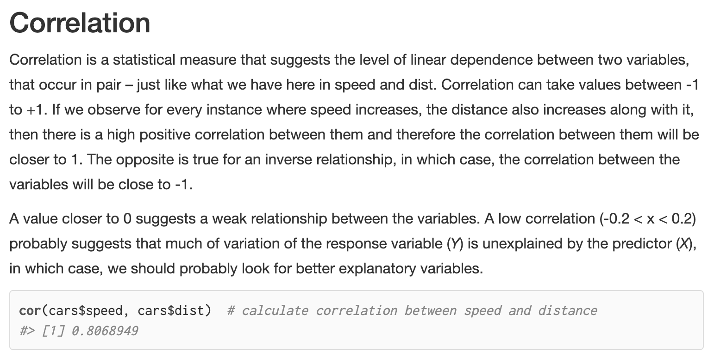

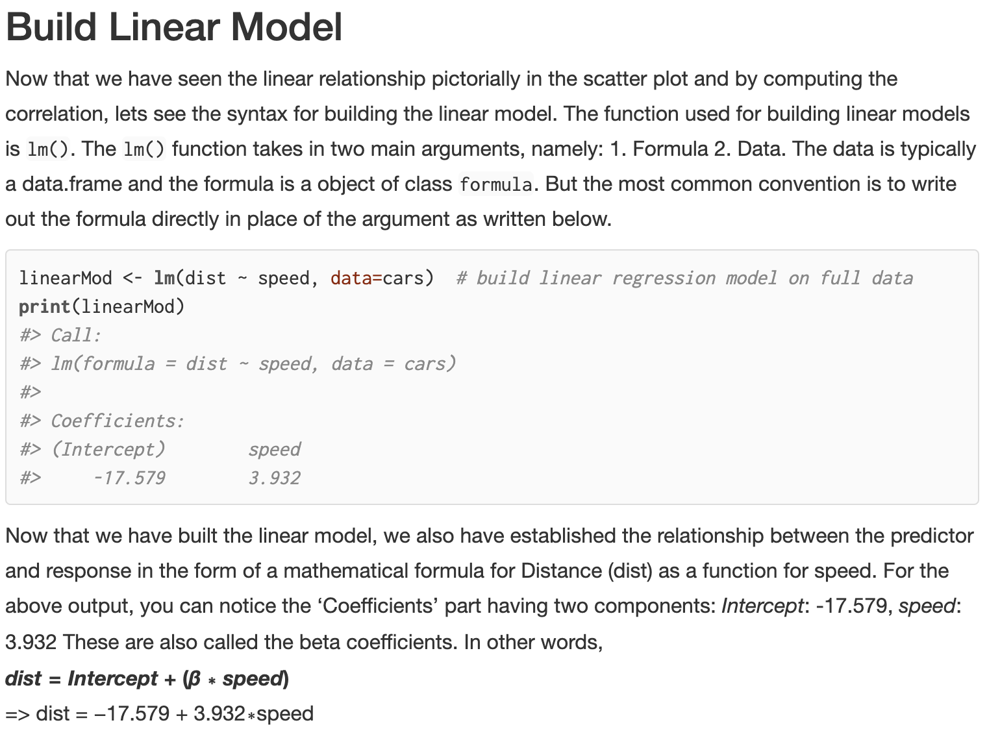

### Regularization
Drawbacks of Linear Regression:
    - Training set need to capture data feature 
    - Lineaer regression models to minimize sum of squred error -> overfit 
    - Cannot model non-linear relationship 
Regularization: Make prediction less sensitive to training set size
    - Ridge Regression(L2): 
        - loss function is modified to minimize complexity of the model: penalize large coefficient 
            $Loss function = \sum Error^2 + \lambda \sum coefficient^2$
    - Lasso Regression(L1):
        -  loss function is modified to minimize the complexity of the model by limiting the sum of the absolute values of the model coefficients
            $Loss function = \sum Error^2 + \lambda\sum|coefficient|$
    - Lasso vs Ridge: 
        - When $\lambda \rightarrow \inf$:
            - Lasso could lead to slope of some variable goes to 0
            - Ridge can not 
        - Lasso could be used for variable selection 
    - ElasticNet: 
        - Elastic net regression combines the properties of ridge and lasso regression. It works by penalizing the model using both the 1l2-norm1 and the 1l1-norm1.
    - How to pick for $\lambda$: Cross Validation pick the lambda gives the lower test error. 
        -k-fold Cross Validation: In k-fold cross-validation, the original sample is randomly partitioned into k equal sized subsamples. Of the k subsamples, a single subsample is retained as the validation data for testing the model, and the remaining k − 1 subsamples are used as training data. The cross-validation process is then repeated k times, with each of the k subsamples used exactly once as the validation data. 
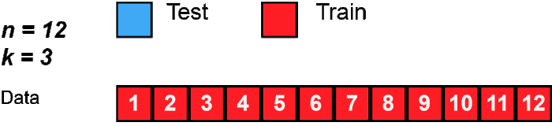
```{r}
# Load the data
data("Boston", package = "MASS")
# Split the data into training and test set
set.seed(123)
training.samples <- Boston$medv %>%
  createDataPartition(p = 0.8, list = FALSE)
train.data  <- Boston[training.samples, ]
test.data <- Boston[-training.samples, ]
# Predictor variables
x <- model.matrix(medv~., train.data)[,-1]
# Outcome variable
y <- train.data$medv
lambda <- 10^seq(-3, 3, length = 100)
```

```{r Ridge}
# ridge 
# Build the model
set.seed(123)
ridge <- train(
  medv ~., data = train.data, method = "glmnet",
  trControl = trainControl("cv", number = 10),
  tuneGrid = expand.grid(alpha = 0, lambda = lambda)
  )
```


```{r Ridge2}
# Model coefficients
coef(ridge$finalModel, ridge$bestTune$lambda)
# Make predictions
predictions <- ridge %>% predict(test.data)
# Model prediction performance
data.frame(
  RMSE = RMSE(predictions, test.data$medv),
  Rsquare = R2(predictions, test.data$medv)
)
```

```{r Lasso }
set.seed(123)
lasso <- train(
  medv ~., data = train.data, method = "glmnet",
  trControl = trainControl("cv", number = 10),
  tuneGrid = expand.grid(alpha = 1, lambda = lambda)
  )
# Model coefficients
coef(lasso$finalModel, lasso$bestTune$lambda)
# Make predictions
predictions <- lasso %>% predict(test.data)
# Model prediction performance
data.frame(
  RMSE = RMSE(predictions, test.data$medv),
  Rsquare = R2(predictions, test.data$medv)
)
```

```{r ElasticNet}
set.seed(123)
elastic <- train(
  medv ~., data = train.data, method = "glmnet",
  trControl = trainControl("cv", number = 10),
  tuneLength = 10
  )
# Model coefficients
coef(elastic$finalModel, elastic$bestTune$lambda)
# Make predictions
predictions <- elastic %>% predict(test.data)
# Model prediction performance
data.frame(
  RMSE = RMSE(predictions, test.data$medv),
  Rsquare = R2(predictions, test.data$medv)
)
```

```{r Compare Models}
models <- list(ridge = ridge, lasso = lasso, elastic = elastic)
resamples(models) %>% summary( metric = "RMSE")
```

### Logistic Regression
Logistic regression is a predictive modeling algorithm that is used when the Y variable is binary categorical. That is, it can take only two values like 1 or 0. The goal is to determine a mathematical equation that can be used to predict the probability of event 1. Once the equation is established, it can be used to predict the Y when only the X are known.
$ y={\begin{cases}1&\beta _{0}+\beta _{1}x+\varepsilon >0\\0&{\text{else}}\end{cases}}$

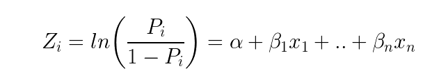
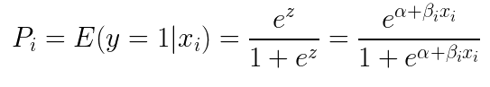
```{r}
data(BreastCancer, package="mlbench")
bc <- BreastCancer[complete.cases(BreastCancer), ]  # create copy
str(bc)
glm(Class ~ Cell.shape, family="binomial", data = bc)
# remove id column
bc <- bc[,-1]
# convert factors to numeric
for(i in 1:9) {
 bc[, i] <- as.numeric(as.character(bc[, i]))
}
bc$Class <- ifelse(bc$Class == "malignant", 1, 0)
bc$Class <- factor(bc$Class, levels = c(0, 1))
table(bc$Class)
logitmod <- glm(Class ~ Cl.thickness + Cell.size + Cell.shape, family = "binomial", data=bc)
```

```{r}
set.seed(100)
trainDataIndex <- createDataPartition(bc$Class, p=0.7, list = F)  # 70% training data
trainData <- bc[trainDataIndex, ]
testData <- bc[-trainDataIndex, ]
table(trainData$Class)
set.seed(100)
up_train <- upSample(x = trainData[, !(colnames(trainData) %in% "Class")],
                     y = trainData$Class)

table(up_train$Class)
logitmod <- glm(Class ~., family = "binomial", data=up_train)
logitmod2 <- glm(Class ~Bl.cromatin, family = "binomial", data=up_train)
summary(logitmod)
summary(logitmod2)
```

```{r}
pred <- predict(logitmod, newdata = testData, type = "response")
y_pred_num <- ifelse(pred > 0.5, 1, 0)
y_pred <- factor(y_pred_num, levels=c(0, 1))
y_act <- testData$Class
mean(y_pred == y_act) 

```
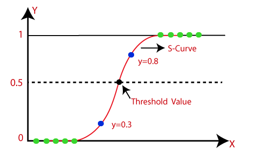


## SVM Overview

- Goal: draw a line or hyperplane called a decision boundary separating
the classes such that the *margin* (min distance to the hyperplane) is
maximized.
- SVM can use different kernels to draw different decision boundaries.
    - Transform the data, and then draw a linear boundary in the
    transformed space.
- `kernel = "linear"` means SVM draws a linear decision boundary.


- Prevents overfitting
- SVM algorithm creates the best line or decision boundary that can segregate n-dimensional space into classes (This best decision boundary is called a hyperplane.)
- SVM chooses the extreme points/vectors that help in creating the hyperplane. These extreme cases are called as support vectors
- Linear SVM: Linear SVM is used for linearly separable data, which means if a dataset can be classified into two classes by using a single straight line, then such data is termed as linearly separable data, and classifier is used called as Linear SVM classifier.
- Non-linear SVM: Non-Linear SVM is used for non-linearly separated data, which means if a dataset cannot be classified by using a straight line, then such data is termed as non-linear data and classifier used is called as Non-linear SVM classifier.
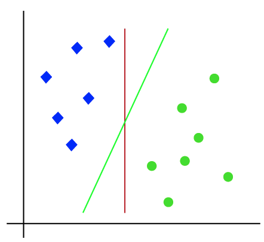
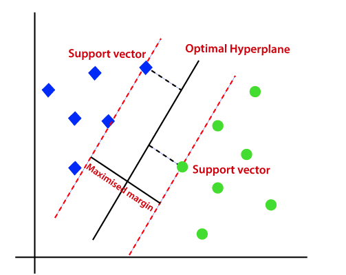

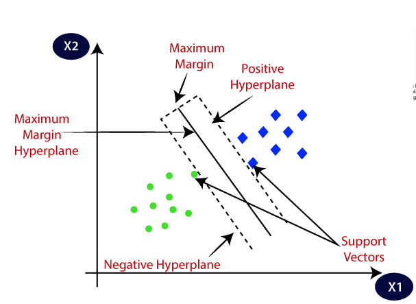
## Non-linear
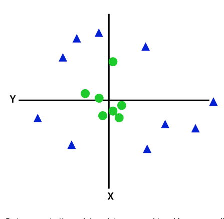

Let$z = x^2 +y^2$

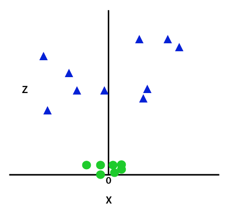

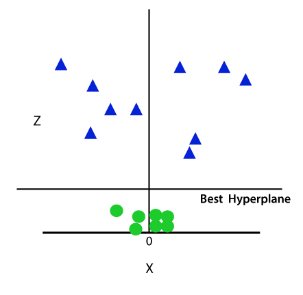

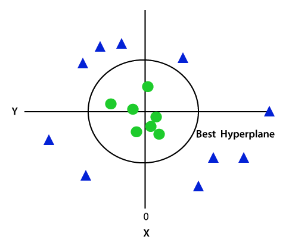
## SVM: Toy example

```{r simdata, echo = FALSE}
# Simulate points in an annulus using rejection sampling. Won't actually
# get n points per try. r1 and r2 are the inner and outer radii,
# respectively.
sim_annulus <- function(n, r1, r2) {
    # don't worry about this code! Not needed for Stat115.
    stopifnot(r1 < r2)
    pts <- matrix(runif(2 * n, -1, 1), nrow = n, ncol = 2)
    radii <- sqrt((pts[, 1])^2 + (pts[, 2])^2)
    good_inds <- (radii >= r1) & (radii <= r2)
    good_pts <- pts[good_inds,]
    colnames(good_pts) = c("x", "y")
    return(good_pts)
}
# generate the data
set.seed(0) # set seed for reproducibility
circ1 <- sim_annulus(2500, 0.3, 0.5)
circ2 <- sim_annulus(1000, 0.8, 1)
circ_dat <- rbind(circ1, circ2)
type <- as.factor(c(rep("Type 1", nrow(circ1)),
                    rep("Type 2", nrow(circ2))))
circ_df <- as.data.frame(circ_dat)
circ_df$type <- type
head(circ_dat)
head(type)
ggplot(circ_df, aes(x = x, y = y, color = type)) + geom_point()
```

## SVM: Using Linear kernel

- Using the `tune` function to perform cross validation.
- Can plot the decision boundary for this simpler case:

```{r svm-linear}
set.seed(0)
shuffle_inds <- sample(1:nrow(circ_df), replace = FALSE)
svm_tune <- tune(svm, circ_dat[shuffle_inds, ], type[shuffle_inds],
                 kernel = "linear",
                 ranges = list(cost = c(0.01, 0.1, 1, 10)),
                 tunecontrol = tune.control(cross = 3))
plot(svm_tune)
svm_tune
# Technical note: svm can use a formula or matrices. We use formula
# here in order to make the plot.
svm_circ <- svm(type ~ x + y, data = circ_df, kernel = "linear",
                cost = 1)
confusionMatrix(svm_circ$fitted, circ_df$type)$table
plot(svm_circ, circ_df)
```

## SVM: Using Radial Kernel on Toy Example

```{r svm-radial}
svm_circ_radial <- svm(type ~ x + y, data = circ_df, kernel = "radial")
confusionMatrix(svm_circ_radial$fitted, circ_df$type)$table
plot(svm_circ_radial, circ_df)
```
## Random Forest 
- supervised learning technique, can be used for both Classification and Regression problems
- Based on the concept of ensemble learning, which is a process of combining multiple classifiers to solve a complex problem and to improve the performance of the model.
- Random Forest is a classifier that contains a number of decision trees on various subsets of the given dataset and takes the average to improve the predictive accuracy of that dataset.
- Instead of relying on one decision tree, the random forest takes the prediction from each tree and based on the majority votes of predictions, and it predicts the final output.
- The greater number of trees in the forest leads to higher accuracy and prevents the problem of overfitting.
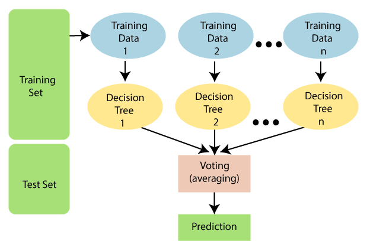

##Assumptions for Random Forest
Since the random forest combines multiple trees to predict the class of the dataset, it is possible that some decision trees may predict the correct output, while others may not. But together, all the trees predict the correct output. Therefore, below are two assumptions for a better Random forest classifier:

There should be some actual values in the feature variable of the dataset so that the classifier can predict accurate results rather than a guessed result.
The predictions from each tree must have very low correlations.

##Why use Random Forest?
It takes less training time as compared to other algorithms.
It predicts output with high accuracy, even for the large dataset it runs efficiently.
It can also maintain accuracy when a large proportion of data is missing.
Random Forest works in two-phase first is to create the random forest by combining N decision tree, and second is to make predictions for each tree created in the first phase.

The Working process can be explained in the below steps and diagram:

Step-1: Select random K data points from the training set.

Step-2: Build the decision trees associated with the selected data points (Subsets).

Step-3: Choose the number N for decision trees that you want to build.

Step-4: Repeat Step 1 & 2.

Step-5: For new data points, find the predictions of each decision tree, and assign the new data points to the category that wins the majority votes.
Advantage: 
Random Forest is capable of performing both Classification and Regression tasks.
It is capable of handling large datasets with high dimensionality.
It enhances the accuracy of the model and prevents the overfitting issue.

Disadvantages :
Although random forest can be used for both classification and regression tasks, it is not more suitable for Regression tasks.

##Example:
Suppose there is a dataset that contains multiple fruit images. So, this dataset is given to the Random forest classifier. The dataset is divided into subsets and given to each decision tree. During the training phase, each decision tree produces a prediction result, and when a new data point occurs, then based on the majority of results, the Random Forest classifier predicts the final decision. Consider the below image:

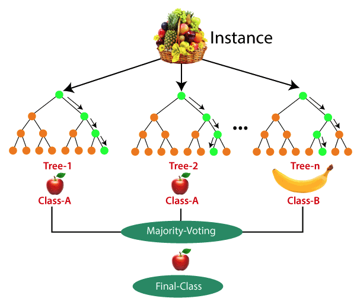

##Example
```{r}
library(ROCR)
#import the package
library(randomForest)
library(datasets)
data(iris)
# Perform training:
set.seed(17)
# Calculate the size of each of the data sets:
data_set_size <- floor(nrow(iris)/2)
# Generate a random sample of "data_set_size" indexes
indexes <- sample(1:nrow(iris), size = data_set_size)
# Assign the data to the correct sets
training <- iris[indexes,]
validation1 <- iris[-indexes,]
rf_classifier = randomForest(Species ~ ., data=training, ntree=100, mtry=2, importance=TRUE)
rf_classifier
prediction_for_table <- predict(rf_classifier,validation1[,-5])
table(observed=validation1[,5],predicted=prediction_for_table)
# Calculate the probability of new observations belonging to each class
# prediction_for_roc_curve will be a matrix with dimensions data_set_size x number_of_classes
prediction_for_roc_curve <- predict(rf_classifier,validation1[,-5],type="prob")
# Use pretty colours:
pretty_colours <- c("#F8766D","#00BA38","#619CFF")
# Specify the different classes 
classes <- levels(validation1$Species)
# For each class
for (i in 1:3)
{
 # Define which observations belong to class[i]
 true_values <- ifelse(validation1[,5]==classes[i],1,0)
 # Assess the performance of classifier for class[i]
 pred <- prediction(prediction_for_roc_curve[,i],true_values)
 perf <- performance(pred, "tpr", "fpr")
 if (i==1)
 {
     plot(perf,main="ROC Curve",col=pretty_colours[i]) 
 }
 else
 {
     plot(perf,main="ROC Curve",col=pretty_colours[i],add=TRUE) 
 }
 # Calculate the AUC and print it to screen
 auc.perf <- performance(pred, measure = "auc")
 print(auc.perf@y.values)
}
```

